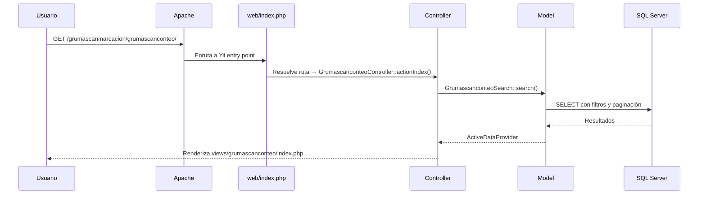
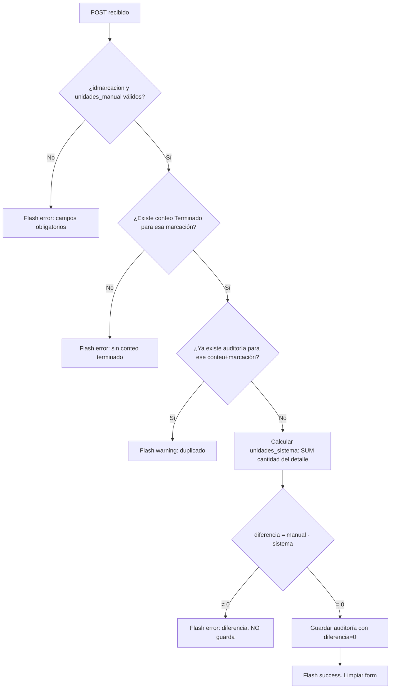
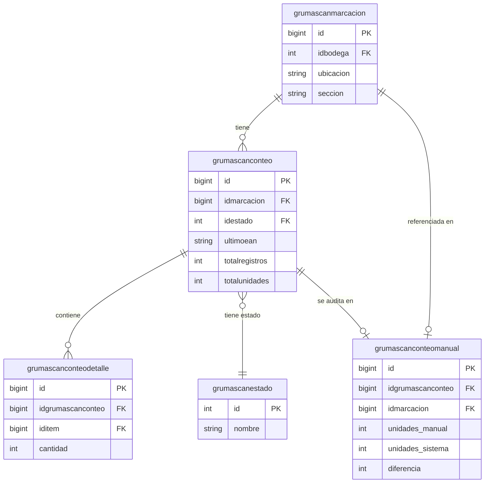

# Documento Técnico — GRUMALOG Scan

> **Fecha de generación:** 2026-04-17  
> **Versión del documento:** 1.0  
> **Alcance:** Documento generado a partir del análisis directo del código fuente, archivos de configuración y estructura del repositorio en `\\192.168.2.20\c$\Apache24\htdocs\grumalog-scan`. La información marcada como `TODO` o `Pendiente de validación` requiere confirmación antes de ser usada como referencia definitiva en producción.

---

## Tabla de contenidos

1. [Resumen técnico](#1-resumen-técnico)
2. [Objetivo y alcance](#2-objetivo-y-alcance)
3. [Arquitectura general](#3-arquitectura-general)
4. [Stack tecnológico](#4-stack-tecnológico)
5. [Estructura de carpetas](#5-estructura-de-carpetas)
6. [Componentes y módulos](#6-componentes-y-módulos)
7. [Persistencia y modelo de datos](#7-persistencia-y-modelo-de-datos)
8. [APIs e integraciones](#8-apis-e-integraciones)
9. [Variables de entorno y configuración](#9-variables-de-entorno-y-configuración)
10. [Instalación local](#10-instalación-local)
11. [Ejecución en desarrollo](#11-ejecución-en-desarrollo)
12. [Build y empaquetado](#12-build-y-empaquetado)
13. [Testing](#13-testing)
14. [Despliegue](#14-despliegue)
15. [Seguridad](#15-seguridad)
16. [Observabilidad y manejo de errores](#16-observabilidad-y-manejo-de-errores)
17. [Rendimiento y puntos críticos](#17-rendimiento-y-puntos-críticos)
18. [Riesgos técnicos y deuda técnica](#18-riesgos-técnicos-y-deuda-técnica)
19. [Checklist de entrega](#19-checklist-de-entrega)
20. [Mantenimiento futuro](#20-mantenimiento-futuro)
21. [Supuestos y vacíos detectados](#21-supuestos-y-vacíos-detectados)

---

## 1. Resumen técnico

GRUMALOG Scan es una aplicación web PHP construida sobre **Yii 2 Framework** (arquitectura MVC). Opera como sistema especializado de auditoría de inventarios para Grupo Mayorista S.A. Conecta a dos bases de datos SQL Server: la base de datos interna GRUMALOG (servidor on-premise) y el ERP SIESA (instancia RDS en AWS). La aplicación es de tipo monolítico, sin API REST expuesta al exterior.

---

## 2. Objetivo y alcance

**Objetivo:** Proveer una interfaz web para que operarios de bodega registren conteos físicos de mercancía, y auditores verifiquen la exactitud de esos conteos comparándolos con los registros del sistema ERP.

**Dentro del alcance:**
- Gestión de marcaciones (puntos de conteo físico).
- Registro de sesiones de conteo con detalle por ítem.
- Auditoría manual con cálculo automático de diferencias.
- Consulta de existencias contra SIESA.
- Impresión de stickers de marcación.
- Autenticación con permiso granular (`grumascan`).

**Fuera del alcance:**
- Gestión de órdenes de compra o despacho.
- Ajuste de inventarios en SIESA desde esta aplicación.
- API REST pública.
- Notificaciones push o correo automático por diferencias detectadas.

---

## 3. Arquitectura general

La aplicación sigue el patrón **MVC de Yii 2** con una estructura de módulo principal.

```mermaid
graph TD
    Browser["Navegador (Bootstrap 5)"]
    Apache["Apache HTTP Server"]
    Yii["Yii 2 Application\n(PHP 7.4+)"]
    ModGS["Módulo: grumascanmarcacion\n(Controllers, Views, Forms)"]
    Models["Models / ORM\n(ActiveRecord)"]
    DBGL["SQL Server\nGRUMALOG\n(SRVICGBD1\\APP)"]
    DBSIESA["SQL Server\nSIESA ERP\n(AWS RDS us-east-1)"]

    Browser -->|HTTP| Apache
    Apache -->|FastCGI / mod_php| Yii
    Yii --> ModGS
    ModGS --> Models
    Models -->|yii\\db (db component)| DBGL
    Models -->|yii\\db (dbsiesa component)| DBSIESA
```

**Flujo de una petición:**



---

## 4. Stack tecnológico

| Capa | Tecnología | Versión |
|---|---|---|
| **Lenguaje** | PHP | 7.4+ (mínimo requerido) |
| **Framework** | Yii 2 | ~2.0.45 |
| **Frontend UI** | Bootstrap | 5.x |
| **Grid/Tablas** | Kartik Grid | ^3.5 |
| **Dropdowns** | Select2 (yii2-select2) | ^2.2 |
| **Iconos** | kartik-v/yii2-icons | ^1.0 |
| **Mail** | yii2-symfonymailer | ~2.0.3 |
| **ORM** | Yii2 ActiveRecord | — |
| **Base de datos principal** | Microsoft SQL Server | Pendiente de validación |
| **Base de datos ERP** | Microsoft SQL Server (AWS RDS) | Pendiente de validación |
| **Driver DB** | sqlsrv (PHP extension) | — |
| **Cache** | File-based (yii\caching\FileCache) | — |
| **Servidor web** | Apache HTTP Server | Apache 2.4 |
| **Testing** | Codeception | ^5.0 / ^4.0 |
| **Gestor de dependencias** | Composer | — |

---

## 5. Estructura de carpetas

```
grumalog-scan/
├── assets/                   # Definición de asset bundles (AppAsset.php)
├── commands/                 # Comandos CLI (yii console)
│   └── HelloController.php
├── config/                   # Configuraciones de la aplicación
│   ├── web.php               # Config principal web (módulos, componentes, acceso)
│   ├── console.php           # Config para CLI
│   ├── db.php                # Conexión GRUMALOG (SQL Server on-premise)
│   ├── db_siesa.php          # Conexión SIESA (SQL Server AWS RDS)
│   ├── params.php            # Parámetros de negocio y constantes
│   ├── test.php              # Config para entorno de test
│   └── test_db.php           # DB para tests
├── controllers/              # Controladores de la aplicación base
│   └── SiteController.php    # Login, logout, index, error, contact
├── mail/                     # Templates de correo electrónico
│   └── layouts/
├── models/                   # Modelos ActiveRecord y formularios
│   ├── User.php              # Identidad y autenticación
│   ├── Inventario.php        # Existencias (GRUMALOG + SIESA)
│   ├── Bodegas.php
│   ├── Item.php
│   ├── Grumascan*.php        # Modelos del módulo de escaneo
│   ├── forms/                # Form models (Print, UseSticker)
│   └── search/               # Search models para DataProvider
├── modules/
│   └── grumascanmarcacion/   # MÓDULO PRINCIPAL
│       ├── Module.php
│       ├── controllers/      # 6 controllers (ver sección 6)
│       └── views/            # Vistas por controller
├── tests/                    # Suite de pruebas Codeception
│   ├── unit/
│   ├── functional/
│   └── acceptance/
├── views/                    # Vistas de la aplicación base
│   ├── layouts/main.php      # Layout principal (Bootstrap 5, navbar)
│   └── site/                 # Login, index, error, about, contact
├── web/                      # Document root del servidor web
│   ├── index.php             # Entry point (YII_DEBUG, YII_ENV)
│   ├── index-test.php        # Entry point para tests
│   ├── .htaccess             # Reglas de reescritura de URL
│   ├── css/site.css
│   ├── js/
│   ├── imagenes/
│   └── assets/               # Assets compilados por Yii (auto-generados)
├── vendor/                   # Dependencias Composer (no versionar)
├── runtime/                  # Logs, cache, debug (no versionar)
├── composer.json
├── composer.lock
├── codeception.yml
├── yii                       # CLI entry point (Unix)
└── yii.bat                   # CLI entry point (Windows)
```

---

## 6. Componentes y módulos

### 6.1 Módulo `grumascanmarcacion`

Módulo Yii 2 que contiene toda la lógica de negocio del sistema. Registro en `config/web.php` bajo la clave `grumascanmarcacion`.

**Controladores:**

| Controller | Ruta base | Acciones principales |
|---|---|---|
| `DefaultController` | `/grumascanmarcacion/` | index (dashboard del módulo) |
| `GrumascanmarcacionController` | `/grumascanmarcacion/grumascanmarcacion/` | CRUD + use-sticker + validar-usar-sticker (AJAX) |
| `GrumascanconteoController` | `/grumascanmarcacion/grumascanconteo/` | CRUD + anular |
| `GrumascanconteodetalleController` | `/grumascanmarcacion/grumascanconteodetalle/` | CRUD + procesar-formulario + validar-clave-admin |
| `GrumascanconteomanualController` | `/grumascanmarcacion/grumascanconteomanual/` | CRUD con lógica de auditoría |
| `GrumascanestadoController` | `/grumascanmarcacion/grumascanestado/` | CRUD |

**Acceso:** Todos los controladores del módulo requieren usuario autenticado (`@`).

### 6.2 Controlador base: `SiteController`

Gestiona login, logout, página de inicio, contacto y errores. La acción `actionLogin` aplica la validación adicional del campo `grumascan` del usuario.

### 6.3 Comportamientos automáticos en modelos

Todos los modelos ActiveRecord del sistema aplican:

- **`TimestampBehavior`**: rellena `created_at` y `updated_at` con `new Expression('GETDATE()')` en SQL Server.
- **`BlameableBehavior`**: rellena `created_by` y `updated_by` con el ID del usuario autenticado.

### 6.4 Lógica de auditoría manual (`GrumascanconteomanualController::actionCreate`)

Esta acción es la más crítica del sistema. Su flujo:



---

## 7. Persistencia y modelo de datos

### 7.1 Base de datos: GRUMALOG

Servidor: `SRVICGBD1\APP` | Base de datos: `GRUMALOG`

**Tablas propias del sistema:**

| Tabla | Modelo | Descripción |
|---|---|---|
| `grumascanmarcacion` | `Grumascanmarcacion` | Puntos físicos de conteo (stickers) |
| `grumascanconteo` | `Grumascanconteo` | Sesiones de conteo por marcación |
| `grumascanconteodetalle` | `Grumascanconteodetalle` | Items escaneados por sesión |
| `grumascanconteomanual` | `Grumascanconteomanual` | Auditorías manuales de conteos |
| `grumascanestado` | `Grumascanestado` | Catálogo de estados de conteo |

**Tablas de catálogo compartidas:**

| Tabla | Modelo | Descripción |
|---|---|---|
| `usuario` | `User` | Usuarios del sistema (campo `grumascan`: permiso) |
| `bodegas` | `Bodegas` | Almacenes |
| `items` | `Item` | Catálogo de productos |
| `categorias` | `Categoria` | Categorías de producto |
| `subcategorias` | `Subcategoria` | Subcategorías |
| `marcas` | `Marca` | Marcas/fabricantes |
| `tallas` | `Talla` | Tallas |
| `colores` | `Color` | Colores |
| `productos` | `Producto` | Productos |
| `tipodocumento` | `Tipodocumento` | Tipos de documento (Traspaso, CrossDocking) |
| `impresoras` | `Impresora` | Impresoras registradas |
| `impresoraspaxarbodega` | `Impresoraspaxarbodega` | Impresoras asignadas por bodega |
| `unidadempaque` | `Unidadempaque` | Unidades de empaque |
| `bodegatipodocumento` | `Bodegatipodocumento` | Relación bodega–tipo documento |
| `inventario` | `Inventario` | Existencias locales |

**Relaciones principales:**



**Restricción de unicidad relevante:**  
`grumascanconteomanual`: índice único sobre `(idgrumascanconteo, idmarcacion)`. Garantiza una sola auditoría por conteo y marcación.

### 7.2 Base de datos: SIESA (solo lectura)

Servidor: `siesa-m6-sqlsw-distproyeccion.cu94u26q0284.us-east-1.rds.amazonaws.com` | BD: `UnoEE_DistProyeccion_Real`

Tablas consultadas (solo lectura):

| Tabla SIESA | Uso |
|---|---|
| `t400_cm_existencia` | Existencias por bodega/ítem |
| `t150_mc_bodegas` | Lista de bodegas en ERP |
| `t131_mc_items_barras` | Ítems con código de barras |

---

## 8. APIs e integraciones

### 8.1 No hay API REST expuesta

La aplicación no expone endpoints REST al exterior. Toda comunicación es navegador → servidor web (peticiones HTTP estándar y algunas peticiones AJAX para formularios de detalle).

### 8.2 Integración SIESA (SQL Server AWS RDS)

- **Tipo:** Consulta directa SQL Server via extensión `sqlsrv` de PHP.
- **Componente Yii:** `dbsiesa` (definido en `config/web.php` y `config/console.php`).
- **Uso:** Método `Inventario::getTotalExistenciasSiesa()` consulta existencias para comparar con datos locales.
- **Dirección:** Solo lectura desde GRUMALOG Scan hacia SIESA. No hay escritura.

### 8.3 Integración de impresoras de stickers

- **Componente:** `MarcacionStickerPrinter` (namespace `common\components`) — *Pendiente de validación: confirmar ubicación exacta del componente, no se encontró en el árbol de archivos analizado.*
- **Form model:** `GrumascanMarcacionPrintForm` — encapsula los datos para la impresión.
- **Vista:** `indeximprecion.php` dentro del módulo.

---

## 9. Variables de entorno y configuración

El sistema **no usa archivos `.env`**. La configuración se gestiona directamente en archivos PHP bajo `config/`. Para producción se recomienda externalizar credenciales.

### Valores actuales detectados en el código

> **Advertencia de seguridad:** Los siguientes valores están embebidos en archivos de configuración con credenciales en texto plano. Deben ser rotados y externalizados antes de cualquier entrega a un entorno accesible públicamente.

| Parámetro | Archivo | Valor actual | Acción recomendada |
|---|---|---|---|
| `cookieValidationKey` | `config/web.php` | `0RHaV-AbNN-StK0VwIn77IbncSeTXClr` | Rotar en producción |
| `YII_DEBUG` | `web/index.php` | `true` | Cambiar a `false` en producción |
| `YII_ENV` | `web/index.php` | `'dev'` | Cambiar a `'prod'` en producción |
| GRUMALOG DB server | `config/db.php` | `SRVICGBD1\APP` | Externalizar |
| GRUMALOG DB name | `config/db.php` | `GRUMALOG` | Externalizar |
| GRUMALOG DB user | `config/db.php` | `sa` | **Reemplazar por usuario dedicado** |
| GRUMALOG DB password | `config/db.php` | `MasterKey..` | **Rotar inmediatamente** |
| SIESA DB host | `config/db_siesa.php` | `siesa-m6-sqlsw-distproyeccion...rds.amazonaws.com` | Externalizar |
| SIESA DB name | `config/db_siesa.php` | `UnoEE_DistProyeccion_Real` | Externalizar |
| SIESA DB user | `config/db_siesa.php` | `distproyeccion` | Externalizar |
| SIESA DB password | `config/db_siesa.php` | `Distproyeccion$12$%` | **Rotar inmediatamente** |
| `claveAdminConteo` | `config/params.php` | `'1234'` | **Cambiar urgente** |

### Parámetros de negocio (`config/params.php`)

| Parámetro | Valor | Uso |
|---|---|---|
| `proyectoNombre` | `GRUMALOG scan` | Título en interfaz |
| `grupo` | `Grupo mayorista S.A` | Razón social en documentos |
| `nit` | `900.091.175` | NIT empresa |
| `tipodocumento_traspaso` | `2TB` | Código de tipo de documento |
| `tipodocumento_crossdocking` | `2TA` | Código de tipo de documento |
| `bsVersion` | `5.x` | Versión Bootstrap para Kartik |

---

## 10. Instalación local

### Prerequisitos

- PHP 7.4 o superior con extensiones: `pdo_sqlsrv`, `sqlsrv`, `mbstring`, `gd`, `intl`, `xml`, `curl`
- Microsoft ODBC Driver for SQL Server (17 o 18)
- Apache 2.4 con `mod_rewrite` habilitado
- Composer 2.x
- Acceso de red al servidor `SRVICGBD1\APP` (SQL Server GRUMALOG)
- Acceso de red al host de AWS RDS de SIESA (requiere regla en security group o VPN)

### Pasos

```bash
# 1. Clonar / copiar el repositorio
# (O copiar desde \\192.168.2.20\c$\Apache24\htdocs\grumalog-scan)

# 2. Instalar dependencias PHP
composer install --no-dev   # producción
composer install            # desarrollo

# 3. Configurar base de datos
# Editar config/db.php con los datos del servidor GRUMALOG
# Editar config/db_siesa.php con los datos de SIESA

# 4. Configurar Apache
# Document root debe apuntar a /grumalog-scan/web/
# Habilitar mod_rewrite
# Asegurarse de que AllowOverride All esté habilitado para el directorio

# 5. Ajustar permisos
# runtime/ y web/assets/ deben ser escribibles por el proceso de Apache
chmod -R 777 runtime/
chmod -R 777 web/assets/

# 6. Verificar requisitos
php requirements.php

# 7. (Opcional) Ejecutar migraciones si existen
php yii migrate
```

### Configuración de Apache (Virtual Host sugerido)

```apache
<VirtualHost *:80>
    ServerName grumalog-scan.local
    DocumentRoot "/path/to/grumalog-scan/web"
    <Directory "/path/to/grumalog-scan/web">
        Options Indexes FollowSymLinks
        AllowOverride All
        Require all granted
    </Directory>
</VirtualHost>
```

---

## 11. Ejecución en desarrollo

```bash
# Servidor ya debe estar corriendo en Apache
# Acceder a: http://localhost/grumalog-scan/web/

# Para comandos de consola (CLI):
php yii <comando>

# Ejemplo: listar comandos disponibles
php yii help

# Modo debug: ya activo por defecto (YII_DEBUG=true, YII_ENV=dev)
# El debug toolbar de Yii aparece en la esquina inferior de cada página
```

---

## 12. Build y empaquetado

Yii 2 es un framework PHP interpretado. No requiere proceso de build para el backend.

**Assets (CSS/JS):**  
Yii gestiona los assets automáticamente. Al acceder a la aplicación, Yii publica los assets de los paquetes en `web/assets/` (carpetas con hash). Este directorio es generado automáticamente y **no debe versionarse**.

**Para producción:**
1. Ejecutar `composer install --no-dev --optimize-autoloader`
2. Cambiar `YII_DEBUG` a `false` y `YII_ENV` a `'prod'` en `web/index.php`
3. Configurar `cookieValidationKey` con un valor único seguro
4. Rotar todas las credenciales de base de datos
5. Asegurarse de que `runtime/` sea escribible por Apache

---

## 13. Testing

El proyecto incluye configuración de **Codeception** con tres suites:

| Suite | Tipo | Descripción |
|---|---|---|
| `unit` | Pruebas unitarias | Tests de modelos y componentes aislados |
| `functional` | Pruebas funcionales | Simulación de peticiones HTTP sin navegador real |
| `acceptance` | Pruebas de aceptación | Tests con navegador real (requiere Selenium) |

**Ejecución:**

```bash
# Todas las suites
vendor/bin/codecept run

# Suite específica
vendor/bin/codecept run unit
vendor/bin/codecept run functional

# Con reporte detallado
vendor/bin/codecept run --steps
```

**Configuración:** `codeception.yml` en la raíz del proyecto. La base de datos de test se configura en `config/test_db.php`.

> **Pendiente de validación:** No se encontraron tests implementados en `tests/unit/`, `tests/functional/` o `tests/acceptance/`. La infraestructura de testing está configurada pero los casos de prueba específicos están por escribir.

---

## 14. Despliegue

### Entorno actual detectado

- **Servidor:** Windows Server con Apache 2.4 en `\\192.168.2.20`
- **Ruta de despliegue:** `C:\Apache24\htdocs\grumalog-scan\`
- **Acceso web:** `http://192.168.2.20/grumalog-scan/web/` *(Pendiente de validación: confirmar URL exacta)*

### Proceso de despliegue manual (actual)

```
1. Copiar archivos al servidor destino (\\192.168.2.20\c$\Apache24\htdocs\grumalog-scan\)
2. Ejecutar composer install --no-dev en el servidor
3. Verificar permisos de runtime/ y web/assets/
4. Verificar conectividad con SQL Server GRUMALOG y SIESA
5. Acceder a la URL y validar login
```

> **Pendiente de validación:** No se detectó pipeline CI/CD, Dockerfile activo, ni scripts de despliegue automatizado. El `docker-compose.yml` existe en el repositorio pero su contenido y uso activo deben validarse.

---

## 15. Seguridad

### Implementado

| Control | Estado | Detalles |
|---|---|---|
| Autenticación | ✅ Implementado | Yii2 IdentityInterface + sesión PHP |
| Autorización por permiso | ✅ Implementado | Campo `grumascan=1` en tabla `usuario` |
| CSRF protection | ✅ Implementado | Meta tag CSRF en layout, validación automática de Yii |
| Password hashing | ✅ Implementado | Yii Security component |
| Auth key (remember me) | ✅ Implementado | Campo `auth_key` en modelo User |
| Verb filtering | ✅ Implementado | DELETE solo acepta POST (VerbFilter) |
| Access control (básico) | ✅ Implementado | `denyCallback` y `@` en todos los controllers del módulo |
| Clave de administrador | ✅ Implementado | `claveAdminConteo` para acciones sensibles |

### Riesgos identificados

| Riesgo | Severidad | Descripción |
|---|---|---|
| Credenciales en texto plano | **CRÍTICO** | Passwords de DB embebidos en archivos PHP versionados |
| Usuario `sa` en producción | **CRÍTICO** | La conexión a GRUMALOG usa el usuario `sa` (superadmin de SQL Server) |
| `claveAdminConteo = '1234'` | **ALTO** | Clave trivial. Cualquier usuario autenticado puede usarla |
| `YII_DEBUG=true` en producción | **ALTO** | Expone stack traces y configuración interna al navegador |
| `cookieValidationKey` en repo | **MEDIO** | Permite falsificación de cookies si el repo es accesible |
| Sin HTTPS | **MEDIO** | Pendiente de validación — confirmar si Apache tiene SSL configurado |
| Sin rate limiting en login | **BAJO** | No se detectó protección contra fuerza bruta |

---

## 16. Observabilidad y manejo de errores

### Logging

- **Componente:** Yii2 FileTarget (por defecto)
- **Ruta de logs:** `runtime/logs/`
- **Niveles:** error, warning, info (configuración estándar de Yii)

### Debug toolbar

- Activo en entorno `dev` (YII_DEBUG=true)
- Accesible desde `runtime/debug/`
- Provee: SQL queries ejecutadas, tiempos de respuesta, sesión, configuración

### Manejo de errores en la aplicación

- Errores de usuario: Flash messages (error, warning, success) renderizados en el layout.
- Errores HTTP: Manejados por `SiteController::actionError()` con vista `views/site/error.php`.
- Errores de modelo: `$model->getFirstErrors()` mostrados en formularios via `ActiveForm`.
- Excepciones no capturadas: Yii las convierte en respuestas HTTP apropiadas (404, 500).

### Ausencias detectadas

- No se detectó integración con sistemas externos de monitoreo (Sentry, New Relic, etc.).
- No se detectaron alertas automáticas por errores críticos.
- Los logs van solo a archivos locales en el servidor.

---

## 17. Rendimiento y puntos críticos

| Punto | Descripción | Riesgo |
|---|---|---|
| **Consulta SIESA (AWS RDS)** | Cada llamada a `getTotalExistenciasSiesa()` abre una conexión a AWS. Sin pool de conexiones ni cache. | Latencia alta, timeout posible |
| **Assets en desarrollo** | Con `YII_DEBUG=true`, Yii verifica y republica assets en cada request. | Lentitud notable con muchos assets |
| **Sin cache de queries** | No se detectó uso de cache para consultas frecuentes de catálogos (bodegas, ítems, etc.) | Carga innecesaria en DB |
| **File cache** | El cache configurado es basado en archivos, no en memoria. | Menor rendimiento vs Redis/Memcached |
| **Paginación** | Los grids usan `ActiveDataProvider` con paginación. Sin paginación, tablas grandes pueden impactar memoria. | Escala hasta un volumen razonable |

---

## 18. Riesgos técnicos y deuda técnica

| Item | Tipo | Descripción |
|---|---|---|
| Credenciales hardcodeadas | Deuda + Riesgo | Passwords en archivos PHP. Requiere externalización urgente. |
| Usuario `sa` en DB | Riesgo crítico | Principio de mínimo privilegio violado. Crear usuario dedicado con permisos solo sobre GRUMALOG. |
| Sin migraciones formales | Deuda técnica | No se detectaron archivos de migración Yii. El esquema de BD no está versionado junto al código. |
| Tests vacíos | Deuda técnica | La infraestructura Codeception existe pero no hay casos de prueba implementados. |
| `YII_DEBUG=true` en código | Riesgo | El entry point `web/index.php` tiene debug activado con valores hardcodeados, no por variable de entorno. |
| `claveAdminConteo` trivial | Riesgo de seguridad | La clave `'1234'` es inaceptable en producción. |
| Componente `MarcacionStickerPrinter` | Incertidumbre | El namespace `common\components` no corresponde a la estructura de un proyecto Yii2 Basic. Pendiente de validar ubicación real. |
| Sin API REST | Limitación de extensibilidad | Si en el futuro se quiere conectar una app móvil o integración, el sistema deberá ser extendido. |
| Vagrant/Docker no en uso activo | Deuda técnica | Existen `Vagrantfile` y `docker-compose.yml` pero no se usa ninguno como entorno estándar del equipo. |

---

## 19. Checklist de entrega

### Obligatorio antes de producción

- [ ] Cambiar `YII_DEBUG` a `false` y `YII_ENV` a `'prod'` en `web/index.php`
- [ ] Rotar `cookieValidationKey` con un valor generado seguro (`php yii generate/key` o equivalente)
- [ ] Reemplazar usuario `sa` por un usuario SQL Server con permisos mínimos sobre GRUMALOG
- [ ] Rotar contraseña de conexión GRUMALOG
- [ ] Rotar contraseña de conexión SIESA (coordinar con equipo SIESA)
- [ ] Cambiar `claveAdminConteo` por un valor no trivial
- [ ] Externalizar credenciales (variables de entorno del sistema operativo, o archivo fuera del document root)
- [ ] Verificar que `runtime/` y `web/assets/` tengan permisos de escritura para Apache, pero no sean accesibles desde el navegador
- [ ] Confirmar que HTTPS esté configurado en el virtual host
- [ ] Validar conectividad desde el servidor de producción hacia SIESA RDS (puerto TCP 1433, security group AWS)
- [ ] Ejecutar `composer install --no-dev --optimize-autoloader`
- [ ] Verificar que `web/index-test.php` no sea accesible en producción (o eliminarlo)

### Recomendado

- [ ] Implementar al menos tests unitarios para `GrumascanconteomanualController::actionCreate` (lógica crítica)
- [ ] Documentar el esquema de BD en migraciones Yii
- [ ] Establecer rotación periódica de credenciales
- [ ] Configurar monitoreo de errores (Sentry u equivalente)
- [ ] Revisar y ajustar niveles de log para producción

---

## 20. Mantenimiento futuro

### Actualización de dependencias

```bash
# Ver dependencias desactualizadas
composer outdated

# Actualizar dentro de restricciones del composer.json
composer update

# Actualizar Yii2 (con precaución, revisar CHANGELOG)
composer update yiisoft/yii2
```

### Comandos útiles de consola

```bash
# Limpiar cache
php yii cache/flush-all

# Verificar la aplicación
php yii help

# Ejecutar migraciones (cuando se implementen)
php yii migrate
```

### Puntos de extensión naturales

- **Nuevos módulos:** Seguir el patrón de `grumascanmarcacion/` (carpeta en `modules/`, registrar en `config/web.php`).
- **Nuevos modelos:** Heredar de `yii\db\ActiveRecord`, usar `TimestampBehavior` y `BlameableBehavior` siguiendo el patrón existente.
- **Nuevas impresoras:** Extender `Impresoraspaxarbodega` y el componente `MarcacionStickerPrinter`.

---

## 21. Supuestos y vacíos detectados

### Supuestos realizados en este documento

1. El servidor en `\\192.168.2.20` corresponde al entorno de producción o preproducción.
2. El campo `idestado = 1` en `grumascanconteo` corresponde al estado "Terminado" (deducido del código de `actionCreate` de conteo manual).
3. El sistema opera exclusivamente en red interna (no hay exposición a internet).
4. No existe proceso de aprobación por flujo (workflow): los estados los gestiona directamente el operador.
5. La impresión de stickers se realiza desde el mismo servidor web (no hay servidor de impresión dedicado externo).

### Información faltante por validar

| Item | Pendiente |
|---|---|
| URL de producción | Confirmar URL exacta accesible por los usuarios |
| Esquema completo de BD | No se encontraron scripts DDL ni migraciones. Obtener con el DBA. |
| Catálogo de estados de conteo | Obtener todos los valores de `grumascanestado` y su semántica de negocio |
| Componente `MarcacionStickerPrinter` | Localizar el archivo fuente y documentar su funcionamiento |
| Proceso de alta de usuarios | ¿Cómo se crean usuarios y se asigna el permiso `grumascan`? ¿Tiene pantalla de administración o es manual en DB? |
| Configuración de HTTPS | ¿El servidor tiene SSL? ¿Hay un proxy inverso (nginx, IIS) delante de Apache? |
| Política de backups de BD | ¿Se realizan backups de GRUMALOG? ¿Con qué frecuencia? |
| Volumen de datos esperado | ¿Cuántos conteos/marcaciones/items se esperan registrar? |
| Gestión de roles avanzados | Solo se detectó el permiso binario `grumascan`. ¿Hay diferenciación entre auditor y supervisor? |
| Proceso de anulación de conteos | `actionAnular` existe en `GrumascanconteoController` pero su implementación completa no fue analizada en detalle |
| Tipos de documento (Traspaso, CrossDocking) | Existen en `params.php` pero no se encontró la pantalla o flujo donde se usan activamente |
